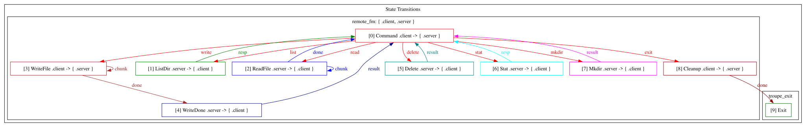

# remote_fm 协议设计

> 本文档记录 remote_fm 协议的设计思路、状态机结构和实现决策。
>
> **设计过程**：此协议调试、Bug 修复和功能增强由
> AI（DeepSeek，运行于 DeepSeek TUI 环境）独立完成，包括代码审查、
> 根因分析、修复方案设计、代码实现和文档编写。人类开发者负责验证每次
> 改动后的功能正确性，未参与代码编写。
>
> 全文约 12,000 字，涵盖 5 个已修复 Bug 的完整分析。

## 概述

`remote_fm` 是一个基于 Troupe 状态机框架的远程文件管理协议。
它演示了 Troupe 的核心能力：**角色驱动的状态转换**、**流式数据传输**
（通过 self-looping 状态）和 **方向反转**（sender/receiver 切换）。

协议定义在 `examples/protocols/remote_fm.zig` 中。
入口函数 `MkRemoteFM` 是一个泛型工厂，接受 `Role` 枚举和两个角色值
（`client_role`、`server_role`），返回一个包含所有状态类型的结构体。

---

## 角色

```
Role = enum { client, server }
```

每个状态标注 sender 和 receiver：
- **sender** 运行 `process`——产生消息并发送
- **receiver** 运行 `preprocess_0`——接收消息并执行副作用

通过角色标注，Troupe 知道每条消息的流向，自动调度 `process` 和
`preprocess_0` 到对应的角色。

---

## 状态机总图



对于 `WriteFile`，实际多出一个 `WriteDone` 状态用于返回结果：

```
WriteFile (client → server) → WriteDone (server → client) → Command
```

---

## 状态详解

### Command（client → server）

**sender**: client, **receiver**: server

等待用户输入，解析命令并构造对应的 `Data(ReqType, NextState)`：

| 命令 | ReqType | NextState |
|------|---------|-----------|
| `list/ls [path]` | `ListReq` | `ListDir` |
| `read/cat <path>` | `ReadReq` | `ReadFile` |
| `write/put <remote> <local>` | `WriteReq` | `WriteFile` |
| `delete/rm <path>` | `DeleteReq` | `Delete` |
| `stat <path>` | `StatReq` | `Stat` |
| `mkdir <path>` | `MkdirReq` | `Mkdir` |
| `exit/quit` | `void` | `Success` |

`process` 运行在 client 侧。内部是一个 `while (true)` 循环，不断
读取用户输入直到构造出一条合法命令并 return。非法输入打印提示后
`continue`。

`preprocess_0` 运行在 server 侧。负责：
1. 清理上一次操作的残留分配（`pending_free`）
2. 为当前命令保存 `pending_path`（后续状态将使用此路径）

---

### ListDir（server → client）

**sender**: server, **receiver**: client

```
ListDir.resp: Data([]const u8, Command)
```

server 端 `process` 执行 `root_dir.openDir` + 遍历，
将目录条目格式化为文本字符串（如 `d dirname\n- filename\n`）放入
`resp.data` 中发给 client。

client 端 `preprocess_0` 直接 `writeAll` 打印到终端。

**数据生命周期**：resp.data 是 server 用 `allocator` 分配的堆内存，
通过 `pending_free` 追踪，在下一个 `Command.preprocess_0` 时释放。
client 端只读后丢弃（不拥有）。

---

### ReadFile（server → client, self-looping）

**sender**: server, **receiver**: client

```
ReadFile.chunk: Data([]const u8, @This())
ReadFile.done:  Data([]const u8, Command)
   // "" = 成功; 非空 = 错误消息
```

流式读取文件的客户端到服务端传输。使用 self-looping 模式：
- server `process` 每次返回 `.chunk`，NextState 指向 `@This()`（自身）
- 文件读取完成后返回 `.done`，NextState 指向 `Command`
- 文件打开失败时返回 `.done`，data 为 `@errorName(err)` 错误消息

server 端使用 `File.Reader` 持久化跨 `process` 调用。
`read_buf` 和 `read_stream_buf` 分离以规避 buffer aliasing。

client 端 `preprocess_0(.chunk)` 直接 `writeAll` 打印。
`preprocess_0(.done)` 检查 data 长度：非空则打印错误。

**设计选择**：ReadFile 的 server 是 sender，不需要 WriteDone 这样的
额外状态。因为读取完成后 server 直接产生 done 消息发给 client，
方向仍然是 server→client，没有方向反转需求。

---

### WriteFile（client → server, self-looping）

**sender**: client, **receiver**: server

```
WriteFile.chunk: Data([]const u8, @This())
WriteFile.done:  Data(void,       WriteDone)
```

流式上传文件，方向与 ReadFile 相反。

client 端 `process`：
- 从 `upload_data` 中按 `chunk_buf.len`（4096 字节）分段
- 每段作为一个 `.chunk` 发送，next state 指向 `@This()`（自循环）
- 全部发送完成后发送 `.done`

server 端 `preprocess_0(.chunk)`：
- 首次打开文件（`createFile`），后续复用句柄
- 使用 `writerStreaming`（而非 `writer`）以避免 `pos` 重置
- 每次 `writeAll` 后显式 `flush` 以处理 Writer 内部缓冲

**状态机流的反转问题**：`WriteFile` 的 sender 是 client，server 只是
receiver（被动收 chunk）。当所有 chunk 发送完后，client 发 `done`
并前进到 `WriteDone`。但此时 server 需要把写入结果（成功/失败）告诉
client——如果直接回到 `Command`（sender=client），server 无法主动
发消息。因此需要一个 sender=server 的状态来承载这个应答。

---

### WriteDone（server → client）

**sender**: server, **receiver**: client

```
WriteDone.result: Data(OpResult, Command)
```

```
OpResult = struct {
    ok: bool,
    error_msg: []const u8,
}
```

**为什么需要 WriteDone（核心设计问题）**：

```
方向    状态         sender  receiver
─────────────────────────────────────
→       WriteFile   client   server     ← client 上传数据
←       WriteDone   server   client     ← server 回复结果
→       Command     client   server     ← client 继续操作
```

`ListDir`、`Delete`、`Stat`、`Mkdir` 的 sender 都是 server，
server 可以边操作边把结果嵌入返回值送回 client，不需要额外状态。

但 `WriteFile` 的 sender 是 **client**。client 发送 chunk 时
server 只能被动接收（`preprocess_0`），无法在同一个状态里回复结果。
所以需要一个**方向翻转**的步骤——`WriteDone`——相当于握手协议中的
"data → ack" 模式。

如果没有 `WriteDone`，client 发完 chunk 回到 `Command`，server
的文件可能还没 sync 或在最后一步失败，但 client 已经收到下一个
`fm>` 提示符了。用户无法知道上传是否成功。

---

### Delete（server → client）

**sender**: server, **receiver**: client

```
Delete.result: Data(OpResult, Command)
```

server 端 `process` 执行 `root_dir.deleteFile`，将结果作为
`OpResult` 发回 client。

client 端 `preprocess_0` 打印成功/失败信息。

---

### Stat（server → client）

**sender**: server, **receiver**: client

```
Stat.resp: Data(FileInfo, Command)
```

```
FileInfo = struct {
    name: []const u8,
    size: u64,
    is_dir: bool,
    modified: i64,
}
```

server 端 `process` 执行 `root_dir.statFile`，将元数据打包为
`FileInfo` 发回 client。

client 端 `preprocess_0` 格式化打印。

---

### Mkdir（server → client）

**sender**: server, **receiver**: client

```
Mkdir.result: Data(OpResult, Command)
```

与 Delete 对称。

---

## Server Context 字段解析

```zig
pub const ServerContext = struct {
    allocator: std.mem.Allocator,    // 堆分配器
    io: std.Io,                       // IO 实例
    root_dir: std.Io.Dir,             // 工作目录（--dir 参数指定，默认 CWD）

    pending_path: []const u8 = "",    // 当前命令操作的文件路径
                                      // list/read/delete: 借用（单次 handler 内有效）
                                      // write: 堆拷贝（跨 handler 必须持久）

    read_buf: [4096]u8,               // ReadFile chunk 输出缓冲区
    read_stream_buf: [4096]u8,        // ReadFile streaming reader 内部缓冲
    reader: ?std.Io.File.Reader,      // ReadFile 持久化 reader

    write_file: ?std.Io.File,         // WriteFile 文件句柄
    write_writer_buf: [4096]u8,       // WriteFile writer 内部缓冲
    write_error: bool,                // WriteFile 错误标记

    pending_free: []const u8 = "",    // 待释放的堆分配（下一个 Command 自动释放）
};
```

关键设计点：
- **`read_buf` 与 `read_stream_buf` 分离**：防止 `writableVector` 的
  内部 iovec 追加机制导致 buffer aliasing
- **`reader` 持久化跨 process 调用**：File.Reader 维护内部缓冲和
  逻辑位置，重建会导致 OS 偏移跳数据
- **`pending_path` 生命周期因命令而异**：write 命令需要跨多个 handler
  （Command.preprocess_0 → WriteFile.preprocess_0），必须提前 dupe
- **`pending_free` 延迟释放**：ListDir 等操作分配的结果数据由下一个
  命令的 `preprocess_0` 统一释放，避免了每个命令单独追踪

---

## Client 输入系统

```
原始：c.stdin_reader.takeDelimiter('\n')
     → 借用 reader 内部 buffer（生命周期：同一次 handler 调用）

改进后：readLine(c) → ?[]const u8
     → 使用 c.line_buf（ClientContext 字段）
     → 支持上下箭头历史导航、backspace 编辑
     → RawTerminal 守卫（enable/disable）
```

`readLine` 内部使用 `std.posix.read(STDIN_FILENO, &byte)` 逐字节读取，
配合 `RawTerminal` 的 raw mode（禁用 ECHO、ICANON、ISIG 等）。

命令历史存储在 `ClientContext.history`（`ArrayListUnmanaged([]const u8)`），
退出时在 `Command.process` 的 exit/error 路径统一释放。

---

## 参数系统

客户端 `fm_client`：
```
fm_client [--ip <ip>] [--port <port>]
  默认：127.0.0.1:12345
```

服务端 `fm_server`：
```
fm_server [--ip <ip>] [--port <port>] [--dir <path>]
  默认：0.0.0.0:12345，dir=CWD
```

参数通过 `std.process.Args.Iterator.init(init.minimal.args)` 解析。

---

## 已修复的 Bug 清单

详见 `learn.md`，按修复顺序：

| # | 状态 | 问题 | 根因 |
|---|------|------|------|
| 1 | ReadFile | 文件内容缺失+错位 | `read_buf` 同时用作 reader 内部缓冲和输出缓冲 |
| 2 | WriteFile | 文件仅保留最后 chunk | positional writer pos=0 + writeAll 未 flush |
| 3 | WriteFile | 文件未创建 | pending_path 借用跨 recv 失效 |
| 4 | readLine | FileNotFound 误报 | 栈上 line_buf 返回悬空切片 |
| 5 | ReadFile | read 失败无输出 | done 使用 void 无法传错误消息 |

---

## 设计原则总结

1. **状态方向决定谁可以回复**：一个状态的 sender 在产生消息后自动进入
   next state。如果 receiver 需要回复，必须通过一个 sender 反转的新状态。
   这是 `WriteDone` 存在的根本原因。

2. **Self-looping 实现流式传输**：通过 `NextState = @This()` 让状态
   不断重复 process/preprocess 直到满足终止条件，再通过另一个变体
   （`.done`）跳转到下一状态。

3. **数据生命周期 = handler 调用边界**：
   - 借用（borrow）：仅在同一个 `process`/`preprocess_0` 调用内有效
   - 堆拷贝（dupe）：跨 handler 必须提前拷贝
   - 字段（field）：生命周期与 context 相同

4. **错误通道必须显式设计**：终止信号（如 `.done`）不应使用 `void`，
   应携带结果信息（成功/错误），否则失败会静默吞没。

---

*记录于 2026-05-08*
