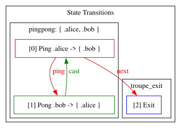
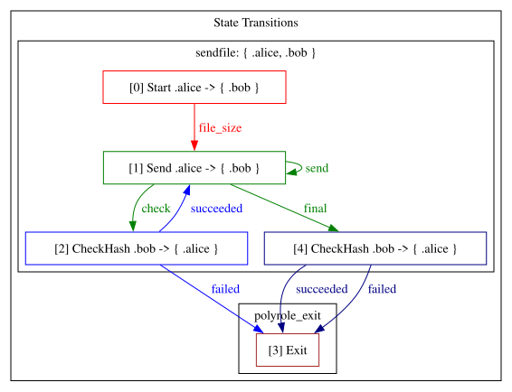
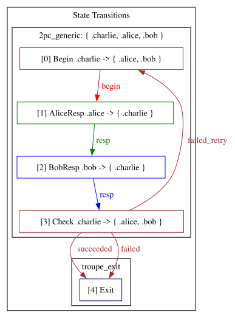

# Troupe – A Deterministic Distributed Protocol Composition Framework

Troupe is a distributed protocol construction library built on Zig's type system. Its core philosophy is **using type determinism to counter communication uncertainty**: protocols are modeled as fully deterministic state machines, correctness is guaranteed through compile-time verification, and all communication unreliability (latency, loss, reordering) is isolated behind replaceable channel layers. Ultimately, developers can construct complex multi-role protocols as if writing single-threaded programs, confident that they will execute as intended in any environment.

[youtube](https://youtu.be/s4WASXIHB_s?si=xKq0E56VFddwet8U), [bilibili](https://www.bilibili.com/video/BV1wgfEBvEHu/?share_source=copy_web&vd_source=06f3616867de4f0c8ec011af7da3e868)

## Core Idea: Protocol as State Graph

In Troupe, a protocol consists of a set of **states**, each represented as a tagged union. Each field of the union represents a possible message, and the message's "next state" is explicitly specified through a type parameter. For example:

```zig
const Ping = union(enum) {
    ping: Data(u32, Pong),
    // ...
};
```

`Data(Payload, NextState)` is a simple wrapper that carries the actual payload and specifies the next state the protocol should enter after this message is sent or received.

Each state also carries compile-time metadata `info` describing the role relationships in this state:

- `sender`: who sends the message in this state.
- `receiver`: who will receive this message (can be multiple).
- `internal_roles`: the set of all roles participating in this protocol.
- `extern_state`: list of "external states" that may be entered after this protocol ends (typically entry or exit points of other protocols).

This information is not just documentation—it is used by the library for compile-time validation and runtime dispatching.

## State Execution Model: Behavior Determined by Role

At runtime, each role (e.g., `alice`, `bob`) independently runs the `Runner.runProtocol` function, which decides how to act based on the current state and its own role:

- **If the role is the sender**: It calls the state's `process` function to generate a message, then sends this message through the channel to all roles in the `receiver` list. It then transitions to the next state specified by the message's `NextState`.
- **If the role is a receiver**: It receives a message from the channel (from the sender), calls the corresponding preprocess function `preprocess_N` (where N is the role's position in the `receiver` list), and then transitions to the next state specified by the message.
- **If the role does not participate in this round**: The state is irrelevant to it—it simply skips this round, but may receive a "notification" from other roles (see below) to synchronize to a new state.

This design ensures that the execution path for each role is **unique and deterministic**: each state explicitly defines who sends, who receives, what is sent, and where to go next.

## Branch States and Full Internal Notification

When a state's union has multiple fields (i.e., multiple branch choices), it means the protocol faces a decision point. For example, in a two-phase commit coordinator state, the coordinator may choose "commit" or "abort" based on participant feedback. In this case, only the sender (coordinator) knows which branch was chosen.

To ensure all internal roles (other roles in `internal_roles`) learn of this choice, **the generated message must be sent to all internal roles except the sender**. This is why the library enforces: when a state's union has more than one field, the receiver list must cover all other internal roles, satisfying `1 + receiver.len == internal_roles.len`.

If any internal role is missing, it would never learn the new state, leading to system-wide inconsistency. This rule fundamentally prevents "partial role ignorance" and is a cornerstone of Troupe's global determinism guarantee.

## Protocol Composition: Nested State Graphs

Troupe's most powerful feature is the ability to seamlessly compose multiple protocols into a larger one. Composition is straightforward: pass one protocol's entry state as the `NextState` type parameter of another protocol's message.

For example, in the `random-pingpong-2pc` demo:

```zig
charlie_as_coordinator: Data(void, PingPong(.alice, .bob, 
    PingPong(.bob, .charlie, 
        PingPong(.charlie, .alice, 
            CAB(@This()).Begin
        ).Ping
    ).Ping
).Ping),
```

Here `PingPong` is a function that generates ping-pong protocol states, accepting role parameters and a next state type, returning a struct containing `Ping`, `Pong`, and other states. Through nested calls, we can make ping-pong automatically enter the `Begin` state of two-phase commit, forming a composite protocol.

At compile time, the `reachableStates` function recursively expands all nested states, building a complete global state graph and generating unique integer IDs for each state. Simultaneously, it performs comprehensive validation:

- Do each state's sender and receiver belong to internal roles?
- Does the receiver list contain the sender? (Not allowed)
- Are there duplicate receivers?
- For branch states, is the number of unnotified roles correct?
- Do all states' context types match (comparing per-role fields)?

These checks ensure the composed protocol remains a valid deterministic state machine.

## Cross-Protocol Synchronization: External Role Notification

When protocol execution reaches a state marked as "external" (appearing in the `extern_state` list), it means the current protocol ends and another begins. To ensure all roles—including those not participating in the current protocol—know about this transition, Troupe mandates that `internal_roles[0]` (the first internal role) sends a special `Notify` message to all **external roles** (roles not in `internal_roles`), containing the new state's ID.

External roles, in their next loop iteration, first receive this notification and jump directly to the corresponding state, synchronizing with internal roles. This "push-style" synchronization avoids blind polling or guessing, ensuring consistent state migration across the entire system.

## Context Aggregation: A Bridge for Data Sharing

Different protocols may need to access the same role's data (e.g., counters, random seeds). Troupe solves this through an **aggregated context structure**: developers define a top-level `Context` where each role has a corresponding field containing all data that role might need (including sub-context fields for various protocols).

For example:

```zig
const Context = struct {
    alice: AliceContext,
    bob: BobContext,
    charlie: CharlieContext,
    selector: SelectorContext,
};
```

In state handler functions (`process`/`preprocess`), the role-specific context type is obtained via `info.Ctx(role)`, and a pointer to that role's field is passed at runtime. This allows different protocols to share data through the same role's context while maintaining isolation between roles.

## Compile-Time Graph Traversal: The Last Line of Defense

Troupe performs a depth-first traversal of all reachable states at compile time via `reachableStates`, generating a complete state list and state ID enumeration. This process not only builds the runtime dispatch table but, more importantly, executes extensive **consistency checks**:

- Verifies that all states' context types match (ensuring each role's field type is consistent across the aggregated context).
- Validates the receiver count rule for branch states.
- Ensures senders and receivers are within internal roles.
- Confirms no role is both sender and receiver.
- Checks that external state lists don't contain internal states (avoiding circular dependencies).

Any rule violation results in a compile error with a clear message. This means that once a program compiles successfully, the protocol composition is guaranteed legal—runtime will never encounter role mismatches or lost states.

## Summary

Troupe's design embodies a profound philosophy: **transform the complexity of distributed protocols into verifiable deterministic models through the type system**. It pushes uncertainty to the communication layer while keeping the protocol core as precise as a script. Developers need only define states, transitions, and role behaviors—the framework handles dispatching, synchronization, and validation automatically.

Whether implementing a simple ping-pong, a multi-role multi-stage two-phase commit, or even dynamic compositions of these protocols, Troupe enables you to build with **type safety, composability, and compile-time verification**, ultimately running reliable, efficient distributed systems.

> **The Troupe Metaphor**: Each role is an actor, protocols are scripts, states are scenes, messages are lines. Actors perform strictly according to the script; even if stage surprises occur (communication latency), backstage crew (channel layer) ensure lines are delivered accurately. The audience always witnesses a deterministic, brilliant performance.


## Adding troupe to your project
Requires zig version 0.16.0.


Download and add troupe as a dependency by running the following command in your project root:
```shell
zig fetch --save git+https://github.com/sdzx-1/troupe.git
```

Then, retrieve the dependency in your build.zig:
```zig
const troupe = b.dependency("troupe", .{
    .target = target,
    .optimize = optimize,
});
```

Finally, add the dependency's module to your module's imports:
```zig
exe_mod.addImport("troupe", troupe.module("root"));
```

You should now be able to import troupe in your module's code:
```zig
const troupe = @import("troupe");
```

## Core idea
### 0. troupe assumes that communication between roles is sequential
troupe ensures that the behavior of each role is completely determined by the state machine.
If the communication itself can guarantee the order (such as TCP), then the protocol described by troupe is deterministic and the behavior of all roles is consistent.

### 1. Compositionality of State

Through [polystate](https://github.com/sdzx-1/polystate), we know that state can be used as a function and parameter, which we call high-order state.

### 2. Viewing the Communication Process as State Machines
Through the introduction [here](https://discourse.haskell.org/t/introduction-to-typed-session/10100), we know that communication can be modeled using a state machine.

### 3. How to handle branch status in multi-role communication
Multi-role communication differs from client-server communication in that troupe requires that messages generated during branching must be notified to all other parties.
This ensures that all roles are synchronized.

### 4. How to Combine Protocols with Different Participants
If two protocol participants are exactly the same, then the states are directly combined.
If the participants of the two protocols are different, then we need to notify all other roles except the roles of the previous protocol.
This [issue](https://github.com/sdzx-1/troupe/issues/15) describes the situation.

## Examples

### pingpong

```shell
zig build pingpong
```

A basic two-role alternating communication protocol between Alice and Bob. Alice sends a number to Bob; Bob increments it and sends it back. After several exchanges, the protocol exits.

This is the simplest possible multi-role Troupe example. It demonstrates:
- **Two-role state machine**: States alternate between `Ping` (Alice as sender) and `Pong` (Bob as sender), showing how `sender` and `receiver` swap between states.
- **Parameterized protocol factory**: `MkPingPong` is a generic protocol template that can be reused with different roles and exit states.
- **Cast state**: `PongFn` is defined as a `Cast` — a higher-order state that wraps a simple function call into a protocol state. This is a reusable building block for request-response patterns.
- **Branch and full notification**: `Ping` has two fields (`ping` and `next`). Since both `alice` and `bob` are in `internal_roles`, the branch condition `1 + receiver.len == internal_roles.len` requires that all internal roles are notified — satisfied here because `receiver = &.{server}`.

The protocol is defined in [`examples/protocols/pingpong.zig`](./examples/protocols/pingpong.zig) as a reusable `MkPingPong` function, and wired into the main entry point in [`examples/pingpong.zig`](./examples/pingpong.zig).



---

### sendfile

```shell
zig build sendfile
```

Alice sends a file to Bob over a TCP connection. Data is streamed in 1 MB chunks. After every 20 MB of data, or when the file ends, the sender sends a hash of the transmitted data; the receiver independently computes the hash and reports whether it matches, enabling early detection of corruption.

This example demonstrates real-world protocol design with Troupe:
- **Self-looping state for streaming**: `Send.send: Data([]const u8, @This())` — the `Send` state references itself, forming a cycle in the state graph that supports arbitrary-length data transfer. This is the pattern for any streaming protocol.
- **State template as protocol subroutine**: `CheckHash(A, B)` is not a single fixed state but a **parameterized state template**. It accepts two type parameters — the success continuation `A` and the failure continuation `B` — and is instantiated twice with different continuations: `CheckHash(@This(), Failed)` for periodic checkpoints (continue sending on success), and `CheckHash(Successed, Failed)` for the final chunk (exit on success).
- **Receiver-driven integrity verification**: The sender commits to a hash; the receiver independently computes the hash and reports the result. The `CheckHash` state reverses sender/receiver roles: the verification result flows from receiver back to sender.
- **Multi-state exit semantics**: `CheckHash` has two branches (`Successed` / `Failed`), each connecting to a different continuation path. This satisfies the branch notification rule: since both roles are internal, `receiver.len` must be 1.
- **TCP StreamChannel**: Unlike the in-memory channel used in other examples, sendfile runs over real TCP sockets, demonstrating that the channel abstraction is transparent to protocol logic. The same protocol definition works with any channel implementation.

The protocol is defined in [`examples/protocols/sendfile.zig`](./examples/protocols/sendfile.zig), with TCP setup and file I/O in [`examples/sendfile.zig`](./examples/sendfile.zig).



---

### 2pc

```shell
zig build 2pc
```

A simulation of the two-phase commit protocol. Charlie (coordinator) initiates a transaction by asking Alice and Bob (participants) to vote. Each participant randomly votes yes or no. If both vote yes, the transaction commits; otherwise, the coordinator may retry or abort.

This example demonstrates multi-role branching and retry logic:
- **Three-role coordination**: Unlike the two-role examples, 2pc involves three roles with different responsibilities — one coordinator and two participants. The state graph integrates all three perspectives into a single definition.
- **Sequential polling with broadcast start**: `Begin` notifies both participants simultaneously (`receiver = &.{alice, bob}`), but responses are collected one at a time through `AliceResp` and `BobResp` (each with `receiver = &.{coordinator}`). This pattern — broadcast notification followed by sequential collection — is common in multi-round protocols.
- **Branch state with retry loop**: `Check` has three branches (`succcessed`, `failed`, `failed_retry`). The `failed_retry` branch transitions back to `Begin`, forming a retry cycle in the state graph. This is the pattern for any protocol with recovery or retry.
- **Context accumulation across states**: The coordinator's context tracks a counter that is incremented by `preprocess_0` handlers in `AliceResp` and `BobResp`. When `Check.process` runs, it uses this accumulated count to decide whether to commit, abort, or retry. This shows how context bridges the gap between protocol states.
- **Parameterized exit gates**: `mk2pc` accepts `Successed` and `Failed` as type parameters, making it a reusable protocol template that can be embedded in larger compositions.

The protocol is defined in [`examples/protocols/two_phase_commit.zig`](./examples/protocols/two_phase_commit.zig), with the main entry point in [`examples/2pc.zig`](./examples/2pc.zig).



---

### random-pingpong-2pc

```shell
zig build random-pingpong-2pc
```

A Selector role randomly chooses one of three composite protocol paths to execute, then repeats for 300 rounds. Each path chains multiple pingpong exchanges between different pairs followed by a two-phase commit with a different coordinator.

This is Troupe's showcase example, demonstrating full compositional power:
- **Protocol composition with different participant sets**: PingPong involves 2 roles; 2PC involves 3 roles. Troupe bridges these different sets through the `extern_state` mechanism — when one sub-protocol ends, `internal_roles[0]` automatically sends a `Notify` message to all roles not participating in that sub-protocol, ensuring the entire system stays synchronized.
- **Nested type composition**: The protocol topology is expressed as a single nested type expression — `PingPong(.alice, .bob, PingPong(.bob, .charlie, ...).Ping).Ping`. The compiler expands this nesting into a flat state graph at compile time, validating all paths.
- **Dynamic runtime choice, compile-time verified**: The Selector's `process` function uses random numbers to pick a branch. All branches are pre-computed in the state graph; the runtime follows the chosen path. The compiler has validated **every possible path** before the program runs.
- **Aggregated context across sub-protocols**: Each role's context bundles fields for both pingpong and 2PC participation. When a role enters a sub-protocol, `info.Ctx` provides access to the relevant subset of its context, keeping handler functions type-safe and focused.

The full composite protocol is defined in [`examples/random_pingpong_2pc.zig`](./examples/random_pingpong_2pc.zig), building on the reusable protocol definitions in [`examples/protocols/`](./examples/protocols/).


